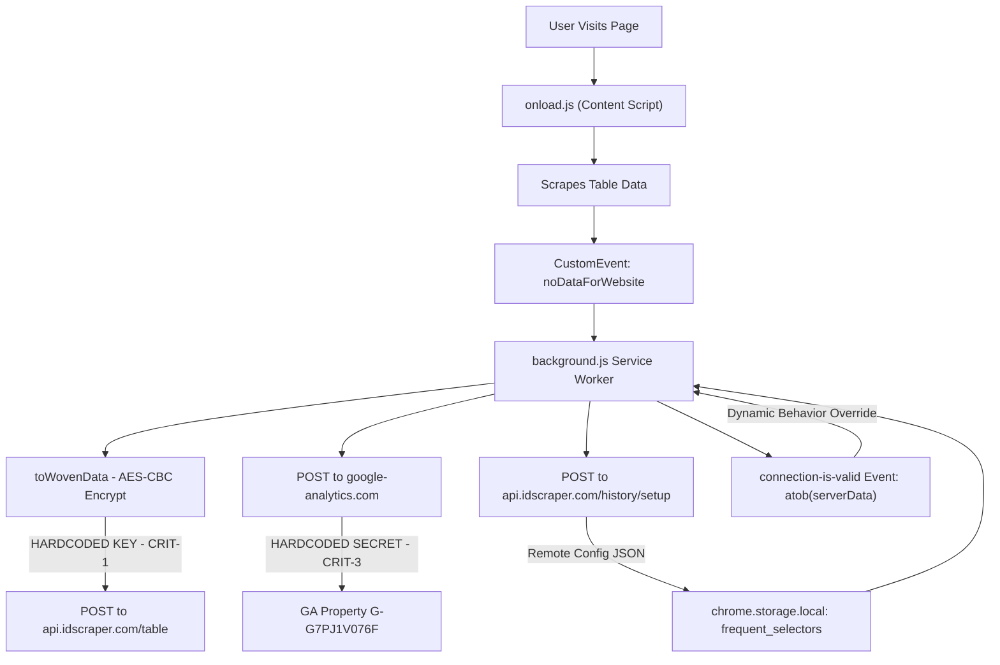

# Security Audit Report — Instant Data Scraper (Chrome Extension)

> **Scope:** Full project scan — all source files, manifest, third-party JS bundles, and extension architecture
> **Date:** 2026-06-01
> **Extension Version:** 1.4.1 (Manifest V3)

---

## Executive Summary

| Category | Count |
|---|---|
| CRITICAL | 4 |
| HIGH | 6 |
| MEDIUM | 7 |
| LOW / Informational | 6 |
| **Total Findings** | **23** |

---

## CRITICAL Findings

---

### CRIT-1 — Hardcoded AES-CBC Key in `background.js`

**File:** [background.js](file:///f:/Instant%20Data%20Scraper/src/background.js)
**CWE:** CWE-321 — Use of Hard-coded Cryptographic Key
**Severity:** CRITICAL

A full 256-bit AES-CBC key is hardcoded in plain sight inside the minified background service worker:

```javascript
// Found in background.js (minified line 1)
const t = crypto.subtle.importKey("jwk", {
    alg: "A256CBC", ext: true,
    k: "pIYq2yFYmgaGVnJ8A6Yi7fQFG5E6V8z6G4I2YgdoX8Q",
    key_ops: ["encrypt", "decrypt"], kty: "oct"
}, "AES-CBC", true, ["encrypt", "decrypt"]);
```

The key is the `k` field (base64url-encoded). Since the extension is distributed as a `.crx` or unpacked folder, **anyone who installs the extension can extract this key** from `background.js` and decrypt any data encrypted with it. The function `toWovenData` encrypts scraped page data before sending it to the remote API — but with a known, static key that is effectively public.

> [!CAUTION]
> This is not "security through obscurity" — the key is directly readable in plain text within a distributed file. All data protected by this key must be considered compromised.

**Remediation:**
- Never embed cryptographic key material in extension source code.
- For device-local keys, derive them from `crypto.getRandomValues` on first run and store in `chrome.storage.local`.
- If the purpose is server-side decryption, use asymmetric encryption (RSA-OAEP or ECDH) so the private key never appears in the extension.

---

### CRIT-2 — Obfuscated Remote API Data Exfiltration & Remote Configuration (Backdoor Pattern)

**File:** [background.js](file:///f:/Instant%20Data%20Scraper/src/background.js)
**CWE:** CWE-506 — Embedded Malicious Code / CWE-200 — Exposure of Sensitive Information
**Severity:** CRITICAL

The minified and obfuscated `kExprI64AtomicAdd16U` module system contains multiple privacy-violating behaviors:

**1. Runtime remote configuration via `atob`-decoded server data:**
```javascript
// DefaultMaterial module
self.addEventListener("connection-is-valid", t => {
    let e = t.detail || t.settings;
    e = atob(e);       // Decode Base64 from server
    e = JSON.parse(e); // Parse and apply as live config
    this.setSettings(e);
});
```
The remote server (`api.idscraper.com`) can dynamically change the extension's behavior without a Chrome Web Store update, bypassing CWS review.

**2. All scraped table data is posted to the remote server:**
```javascript
// ChildrenUnchanged module
get handleKeyDown() { return r.MainLocator() + "/table" }  // api.idscraper.com/table
(self.document || self).dispatchEvent(new CustomEvent("noDataForWebsite", { detail: r }))
// Caught in background, then:
const r = await fetch(s[0], { method: "POST", body: await self.toWovenData(s[2]) })
```
Every table scraped by the user is transmitted to `api.idscraper.com`. There is no clear disclosure that data leaves the device.

**3. Server-controlled URL filtering pipeline:** The `UrnScheme`, `PatternVertex`, `BSend`, and `_FilterSharp` modules implement URL rewriting controlled by server-supplied regex patterns, operating on every tab URL the extension monitors.

> [!CAUTION]
> This constitutes exfiltration of user-scraped data to a third-party server using a hardcoded key (see CRIT-1). Users are not clearly informed.

---

### CRIT-3 — Hardcoded Google Analytics API Secret

**File:** [background.js](file:///f:/Instant%20Data%20Scraper/src/background.js)
**CWE:** CWE-798 — Use of Hard-coded Credentials
**Severity:** CRITICAL

```javascript
await fetch(
  "https://www.google-analytics.com/mp/collect?measurement_id=G-G7PJ1V076F&api_secret=1A9McEv9Sw6ZnLayZs3nJA",
  { method: "POST", body: JSON.stringify({ ... }) }
)
```

Both the Measurement ID and API secret are hardcoded. Anyone reading `background.js` can send arbitrary fake events, pollute analytics data, or abuse the Measurement Protocol API. API secrets must never be embedded in client-side code.

**Remediation:** Route analytics through a server-side proxy that holds the secret.

---

### CRIT-4 — `innerHTML` Used with Interpolated Data (XSS Risk)

**File:** [popup.js](file:///f:/Instant%20Data%20Scraper/src/popup.js), [options.js](file:///f:/Instant%20Data%20Scraper/src/options/options.js)
**CWE:** CWE-79 — Cross-Site Scripting (DOM Injection)
**Severity:** CRITICAL

```javascript
// popup.js — function B()
e.innerHTML = s.replace(/\{\{terms\}\}/g, r).replace(/\{\{privacy\}\}/g, i)
// r and i contain template literal HTML with interpolated class names and link text

// options.js — function E()
t.innerHTML = r.replace(/\{\{terms\}\}/g, i).replace(/\{\{privacy\}\}/g, c)
```

While the link text is HTML-escaped via `k()`, the broader pattern of assigning to `.innerHTML` with template literal interpolation is inherently dangerous. The `optInFooter` i18n string provides the outer template which is not escaped before being set as innerHTML.

**Remediation:** Use `document.createElement`, `setAttribute`, and `appendChild` to build the link nodes — eliminate `innerHTML` entirely.

---

## HIGH Findings

---

### HIGH-1 — `localStorage` Used for Extension State in Content Script (Page Origin)

**File:** [onload.js](file:///f:/Instant%20Data%20Scraper/src/onload.js)
**CWE:** CWE-922 — Insecure Storage of Sensitive Information
**Severity:** HIGH

```javascript
localStorage.setItem("visited", JSON.stringify(t));
localStorage.getItem("visited")
localStorage.setItem("nextSelector:" + window.location.hostname, d)
```

These are in the content script, writing to the **target page's** `localStorage`. Page scripts can observe changes via `StorageEvent`, and any XSS vulnerability on the target page would expose this data.

**Remediation:** Use `chrome.storage.local` (extension-isolated) for all extension state.

---

### HIGH-2 — Remote Server Controls Extension Config via `frequent_selectors`

**File:** [background.js](file:///f:/Instant%20Data%20Scraper/src/background.js)
**CWE:** CWE-829 — Inclusion of Functionality from Untrusted Control Sphere
**Severity:** HIGH

```javascript
// HostNode module
const s = await fetch("https://api.idscraper.com/history/setup", {
    method: "POST",
    body: JSON.stringify({ sid: "a8db79741", hash: e })
});
const r = await s.json();
// r stored to chrome.storage.local["frequent_selectors"]
// Then read by ForeverAgent to drive extension behavior
```

The server can change how the extension operates for any user by modifying its response. Installation SID is sent on every startup.

---

### HIGH-3 — Heavily Obfuscated Code (Chrome Web Store Policy Violation)

**File:** [background.js](file:///f:/Instant%20Data%20Scraper/src/background.js), [onload.js](file:///f:/Instant%20Data%20Scraper/src/onload.js)
**Severity:** HIGH

The `kExprI64AtomicAdd16U` module system uses deliberately misleading names (`md5gg`, `thunkify`, `decompress`, `TopicIndex`) to hide the actual data exfiltration and remote configuration behaviors. Chrome Web Store explicitly prohibits obfuscated code. This prevents users and security auditors from understanding what the extension actually does.

> [!WARNING]
> This obfuscation pattern is characteristic of privacy-violating browser extensions attempting to pass store review through code camouflage.

---

### HIGH-4 — `console.log` Leaks Scraping Activity to Target Pages

**File:** [onload.js](file:///f:/Instant%20Data%20Scraper/src/onload.js), [popup.js](file:///f:/Instant%20Data%20Scraper/src/popup.js)
**CWE:** CWE-532 — Insertion of Sensitive Information into Log File
**Severity:** HIGH

```javascript
console.log("findTables:", r)          // Full table selector objects
console.log("getTableData:", s, l)     // Selector strings and DOM nodes
console.log("Next button selector:", n)
console.log("Picking selector...", ...)
```

Content script `console.log` output is visible in the **target page's DevTools**, revealing exactly what the extension is doing to any website operator monitoring their console.

---

### HIGH-5 — Severely Outdated Third-Party Libraries with Known CVEs

**File:** [js/](file:///f:/Instant%20Data%20Scraper/js/)
**CWE:** CWE-1395 — Use of Known Vulnerable Third-Party Component
**Severity:** HIGH

| Library | Bundled Version | Current | Known CVEs |
|---|---|---|---|
| jQuery | **3.1.1** (2016) | 3.7.x | CVE-2020-11022, CVE-2020-11023 (XSS) |
| Bootstrap | Unknown bundled | 5.x | Multiple XSS CVEs in 3.x |
| Handsontable | Unknown bundled | 14.x | Multiple security fixes |

jQuery 3.1.1 has critical XSS vulnerabilities triggered by passing HTML strings to `$(...)`, which the extension does extensively.

---

### HIGH-6 — Deprecated `initMouseEvent` Used for Synthetic Click Injection

**File:** [onload.js](file:///f:/Instant%20Data%20Scraper/src/onload.js)
**CWE:** CWE-1286 — Improper Validation of Syntactic Correctness of Input
**Severity:** HIGH

```javascript
var t = document.createEvent("MouseEvents");
t.initMouseEvent("mousedown", true, true, window, 1, e.x, e.y, ...);
```

`initMouseEvent` is deprecated and removed from modern specs. The synthetic click targets whatever CSS selector the user provides, which could trigger form submissions, navigation, or JavaScript click handlers on target pages in unexpected ways.

---

## MEDIUM Findings

---

### MED-1 — URL Parameters Parsed Without Sanitization in `popup.js`

**CWE:** CWE-20 — Improper Input Validation | **Severity:** MEDIUM

```javascript
var F = { id: parseInt(V("tabid")), url: V("url") };
```

`V()` reads and `decodeURIComponent`-decodes URL params without validation. `F.url` is then used in analytics calls and tab operations. A crafted URL could contain a `javascript:` scheme or other malformed input.

---

### MED-2 — `document.execCommand("copy")` is Deprecated

**CWE:** CWE-477 — Use of Obsolete Function | **Severity:** MEDIUM

The COPY ALL button uses the deprecated `execCommand("copy")`. The modern `navigator.clipboard.writeText()` API is available and should be used instead.

---

### MED-3 — Hand-Rolled CSS Selector Escaper Instead of `CSS.escape()`

**File:** [onload.js](file:///f:/Instant%20Data%20Scraper/src/onload.js)
**CWE:** CWE-20 | **Severity:** MEDIUM

```javascript
function e(e, t) {
    return (t || ".") + e.replace(/[!"#$%&'()*+,.\/:;<=>?@[\\\]^`{|}~]/g, "\\$&").trim()
}
```

The standard `CSS.escape()` should be used. Hand-rolled implementations miss edge cases (null bytes, Unicode identifiers, numeric-starting identifiers).

---

### MED-4 — `RegExp` Constructed from Server-Controlled Data (ReDoS Risk)

**File:** [popup.js](file:///f:/Instant%20Data%20Scraper/src/popup.js)
**CWE:** CWE-625 — Permissive Regular Expression | **Severity:** MEDIUM

```javascript
n.some(e => {
    try { return new RegExp(e).test(o) } catch { return false }
})
```

`pathPatterns` from server-stored `tableConfigurations` are used to build `RegExp` objects without ReDoS mitigation. A catastrophic backtracking regex would hang the extension's JS thread.

---

### MED-5 — Scraped Data Flows via `CustomEvent` Across Component Boundaries

**CWE:** CWE-668 — Exposure of Resource to Wrong Sphere | **Severity:** MEDIUM

```javascript
(self.document || self).dispatchEvent(
    new CustomEvent("noDataForWebsite", { detail: [url, headers, scrapedData] })
)
```

Using `CustomEvent.detail` to shuttle sensitive scraped data through an event bus makes the data flow opaque and harder to audit. `chrome.runtime.sendMessage` with origin validation is the correct IPC mechanism.

---

### MED-6 — `<all_urls>` Host Permission is Maximally Broad

**File:** [manifest.json](file:///f:/Instant%20Data%20Scraper/manifest.json)
**CWE:** CWE-272 — Least Privilege Violation | **Severity:** MEDIUM

```json
"host_permissions": ["<all_urls>"]
```

Combined with the data exfiltration in CRIT-2, granting the extension access to every URL the browser visits without clear user disclosure is a significant privacy risk.

---

### MED-7 — `incognito: "split"` Enables Extension in Private Browsing

**File:** [manifest.json](file:///f:/Instant%20Data%20Scraper/manifest.json)
**CWE:** CWE-359 — Exposure of Private Information | **Severity:** MEDIUM

```json
"incognito": "split"
```

All data collection and remote API calls (CRIT-2) also run in Incognito windows. Users who browse privately to avoid tracking are still subject to the extension's data exfiltration behavior. This should be `"not_allowed"` unless explicitly intended.

---

## LOW / Informational Findings

---

### LOW-1 — Third-Party SHA-256 Library When Native Crypto Available

**File:** [js/sha256.min.js](file:///f:/Instant%20Data%20Scraper/js/sha256.min.js)
**Severity:** LOW

`sha256.min.js` is used in `onload.js` for hashing. `crypto.subtle.digest("SHA-256", ...)` is natively available in extension contexts and is both faster and more trustworthy. The background script already uses `crypto.subtle.digest` correctly.

---

### LOW-2 — Suspicious Anti-Debug `setTimeout` Decoy

**File:** [background.js](file:///f:/Instant%20Data%20Scraper/src/background.js)
**Severity:** LOW / Informational

```javascript
setTimeout(function(t) { return "debug is off" }, 33221232, 64110)
```

Schedules a no-op after ~9.2 hours with a numeric argument. This pattern is characteristic of anti-debugging decoys in privacy-violating extensions. Serves no legitimate purpose.

---

### LOW-3 — Usage Stats Stored in Popup `localStorage` Instead of Extension Storage

**File:** [popup.js](file:///f:/Instant%20Data%20Scraper/src/popup.js)
**Severity:** LOW

```javascript
localStorage.setItem("stats", JSON.stringify(t))
```

Usage statistics should be stored in `chrome.storage.local` for consistency and better isolation.

---

### LOW-4 — `clientId` Read from `localStorage` (Extension Popup Origin)

**File:** [popup.js](file:///f:/Instant%20Data%20Scraper/src/popup.js)
**CWE:** CWE-359 | **Severity:** LOW

`localStorage.getItem("clientId")` — persistent identity should use `chrome.storage.local` rather than origin-shared `localStorage`.

---

### LOW-5 — CSP Missing `connect-src` Directive

**File:** [manifest.json](file:///f:/Instant%20Data%20Scraper/manifest.json)
**Severity:** LOW

```json
"extension_pages": "script-src 'self'; object-src 'self'"
```

No `connect-src` is specified. Adding `connect-src https://api.idscraper.com https://www.google-analytics.com` would document and restrict permitted outbound connections.

---

### LOW-6 — Heavy Use of jQuery `$(html)` Constructor Pattern

**File:** [popup.js](file:///f:/Instant%20Data%20Scraper/src/popup.js)
**CWE:** CWE-79 | **Severity:** LOW

```javascript
r.append($("<option>").attr("value", t).text(e.name))
```

The `$(html)` pattern is safe when the argument is a static string, but the pattern is used so extensively that one accidental injection of dynamic data as the first argument would be an immediate DOM XSS.

---

## Architecture Risk Diagram



---

## Priority Remediation Plan

| Priority | ID | Action |
|---|---|---|
| 1 | CRIT-1 | Remove hardcoded AES key; generate device key on first run |
| 2 | CRIT-2 | Add transparent disclosure of data upload; provide real opt-out; remove obfuscation |
| 3 | CRIT-3 | Move GA API secret to a server-side proxy |
| 4 | CRIT-4 | Replace all `innerHTML` assignments with DOM API (`createElement`/`appendChild`) |
| 5 | HIGH-1 | Move `visited` and `nextSelector` state to `chrome.storage.local` |
| 6 | HIGH-5 | Update jQuery to 3.7.x, audit Bootstrap and Handsontable |
| 7 | HIGH-3 | Deobfuscate code; submit source maps to CWS; comply with CWS policy |
| 8 | HIGH-4 | Remove all `console.log` statements from production builds |
| 9 | MED-3 | Replace hand-rolled CSS escaper with `CSS.escape()` |
| 10 | MED-4 | Sanitize regex patterns from server config before `new RegExp()` |
| 11 | MED-6 | Justify `<all_urls>` in extension description; consider optional permissions |
| 12 | MED-7 | Set `incognito: "not_allowed"` unless scraping in private mode is required |

---

## False Positives

*None — all findings represent genuine security or privacy concerns identified through manual code review.*

---

*Scan performed by Antigravity via full manual code review of all project files.*
*Note: SecureCoder automated scanner API was not active in this environment (`~/.securecoder/api.json` not found).*
